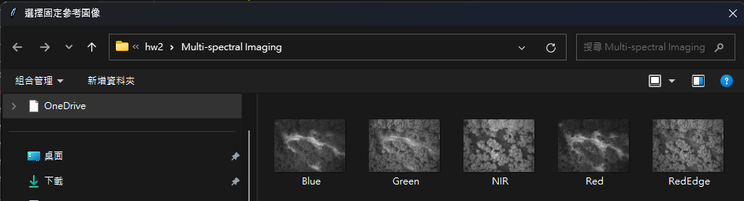

# HW2 多光譜影像對齊

這是一個專門用於影像對齊的工具，特別針對多光譜影像設計。支援一對一和一對多的影像對齊方案，使用SIFT特徵匹配技術。

## 成果展示

### 匹配過程與結果


### 漸進式疊圖


## 功能特點

- 支援單張和批次影像對齊
- 使用SIFT進行特徵檢測和匹配
- 使用單應性轉換進行影像對齊
- 計算RMSE（均方根誤差）評估對齊品質
- 生成多種視覺化結果：
  - 特徵點匹配視圖
  - 對齊向量視圖
  - 漸進式疊圖序列
  - 前後對比動畫

## 目錄結構

```
專案根目錄/
├── image_registration_all_in_one.py    # 主程式
├── Multi-spectral imaging/             # 來源影像輸入目錄
└── results/                            # 結果輸出目錄
    └── {moving}_to_{fixed}_{timestamp}/  # 每次對齊的結果目錄
        ├── *_aligned.png               # 對齊後的影像
        ├── *_matching.png              # 特徵匹配視圖
        ├── *_vectors.png              # 對齊向量視圖
        ├── *_blended.png              # 混合結果
        └── *_sequence.gif             # 動畫序列
```

## 使用方法

1. 將待處理的影像放入 `Multi-spectral imaging` 目錄
2. 執行程式：
   ```bash
   python image_registration_all_in_one.py
   ```
3. 依照互動提示操作：
   - 選擇一對一或一對多模式
   - 選擇參考（固定）影像
   - 一對一模式：選擇待對齊影像
   - 一對多模式：目錄中的其他影像將自動處理

## 輸出檔案說明

程式會在 `results` 資料夾下為每次對齊過程建立新目錄，目錄名稱格式為：`{moving}_to_{fixed}_{timestamp}`

每個結果目錄包含：
- `*_aligned.png`：對齊後的影像
- `*_matching.png`：影像間的特徵匹配視圖
- `*_vectors.png`：顯示對齊轉換的向量場
- `*_blended.png`：固定影像和對齊影像的混合視圖
- `*_sequence.gif`：展示對齊過程的動畫

對於一對多模式，會額外建立 `all_to_{fixed}` 目錄，包含：
- `overlay_step_*.png`：漸進式疊圖步驟
- `final_overlay.png`：最終合成結果
- `progressive_overlay.gif`：漸進式疊圖動畫

## 程式相依套件

- OpenCV (cv2)
- NumPy
- Pillow (PIL)
- tkinter

## 注意事項

- 輸入影像需為TIFF格式 (*.tif, *.tiff)
- 支援單波段和多波段影像
- 提供RMSE計算以評估對齊品質
- results 資料夾將自動建立（如不存在）


